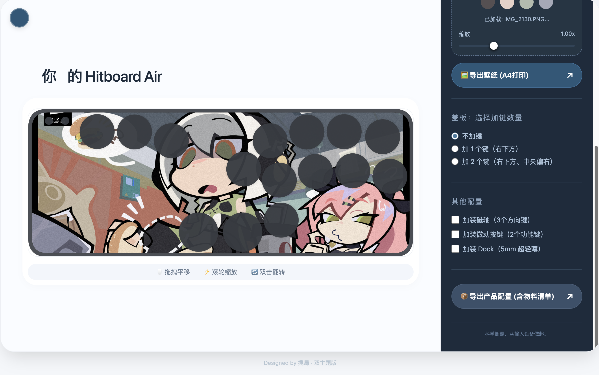
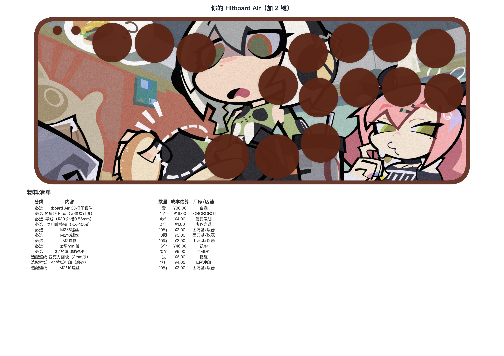
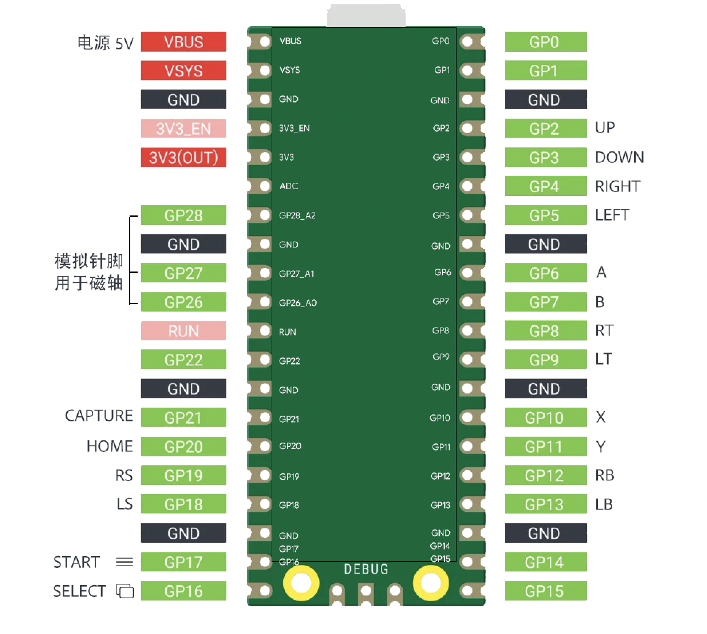
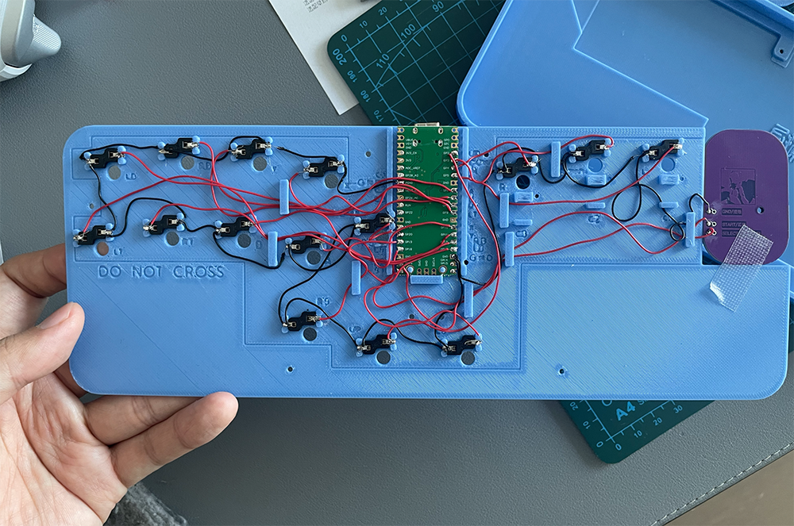
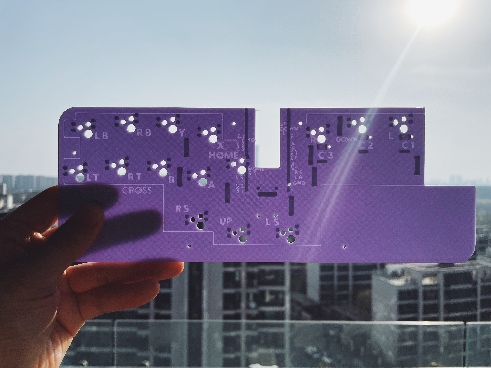

### Hitboard Air - 组装指南

### 准备工作：采购元器件

1. 下载网页工具：00_设计你的 Hitboard Air.html

2. 用浏览器打开该网页，设计你的 Hitboard。设计完成后，点击页面中的「导出产品配置」按钮，导出你的配置图片。

3. 根据配置图片中的物料清单，采购元器件、3D 打印套件。

**3D 打印文件怎么选**

02_3D_Files 目录，包含两套 3D 打印文件，分别是：

「Hitboard Air - 圆润版」

「Hitboard Air - 硬朗版」

//两个版本只有外壳、按键的弧度有区别，内部零件通用。根据你喜欢的风格二选一，或全都选，即可。

### 组装过程

### 第一步：给 Pico 刷入 GP2040 固件

1. 按住 Pico 复位按钮的同时，通过 typec 数据线连接 Pico 到电脑。此时 Pico 将会以 U 盘的形式出现。
    
2. 将固件「GP2040-CE_0.7.12_Pico.uf2」文件，拖拽到 Pico U 盘。
    
3. 等待几秒钟，Pico 会被重新识别为手柄。可以在手柄测试网页 https://hardwaretester.com/gamepad 查看手柄状态，用导线短接 GND 和任意信号引脚查看是否工作。
    

### 第二步：飞线连接元器件

打开「Pico背面图片」，观察的引脚示意图，了解引脚的基本情况。

1. 拿出「Hitboard Air 03 线路板」，板子上布满卡扣，依次将 Pico、轴座卡在对应的位置。

**注意！一定要是正面（有 USB 凸起）朝里，背面（绿色纯平面）朝向自己卡进去。**

    
2. 连接
    
    首先，留意线路板上的“警戒线”标注，警戒线内对应底壳空腔，表示线路可以被容纳。如果超出警戒线，则线路无法被容纳，组装时，无法放平整。

先来给每个按键接 GND。
    
    从 Pico 的任意 GND 方形焊盘，引出导线，将导线依次通过每一个轴座的任一引脚，焊接确保联通（或者缠绕连接）。这样就完成了按键的接地。
        
    将按键轴座另外一个引脚，接到对应的功能。比如方向键「Up」连接到 GP2 Up。
        
    把 4 个方向键、8 个功能键的轴座触点，通过导线，连到 Pico 对应的引脚。
        
    三个加键的轴座触点，连到 Pico 的 LS、RS、Home 引脚，后续需要在设置中，改为你需要的其他按键。

    Select、Start，默认使用导电胶+小电路板实现。把电路板上对应名字的焊盘，与 Pico 引脚相连即可。记得给小电路板连 GND。
        
    // 连接完成后，务必把 Pico 连接到电脑，用导线短接每个轴座的两个引脚。在手柄测试网页查看是否都能生效。
        
    // 如果不生效，检查是否虚焊，直到所有按键电路都正常工作。

        
### 第三步：组装所有板子

    将 03线路板、02定位板，依次放入04外壳。
    
    将轴体压入 02 定位板。//可以用手指挤压轴体左侧的外壳，让轴体不损耗卡扣
    
    放置导电胶按钮。
    
    准备盖板。通过 04 外壳的卡扣卡好即可。
    
    // 如果想要更牢固的固定盖板：
    
        先将 M2 螺丝帽，放入盖板背面的隐藏式螺帽仓。
    
        盖好盖板到外壳。
    
        从外壳背面，拧 6 颗 8mm M2 螺丝。
    
    从00按键中，取下按键，对应按键位置，一一装入。
    
    
### 软件设置

#### 按键配置

1. 按住 Start 按键的同时，通过 typec 连接电脑。
    
2. 访问 GP2040 Web 配置界面（通过 USB 连接后访问 192.168.7.1）
    
3. 点击「功能配置-GPIO 引脚配置」，将 LS、RS、Home 等按键，改为需要的按键。
    
    如果忘了哪个按键对应哪个。点击网页中的「引脚查看器」按钮，在 Hitboard 上按下需要配置的按键，网页会显示引脚编号（如果第一次检测无效就关闭弹窗再次点击）。
        
    在按键列表中找到对应的引脚，编辑按键即可。
        
#### 手柄性能设置：//必做

1. 点击「设置-游戏手柄设置」。
    
2. 将 SOCD 清理模式，改为「后输入优先」。
    
3. 将去抖延迟，改为 0 毫秒。
    
    
### 选配组件

#### Dock

先把本体滑入Dock上半。（滑入前，将 2 颗 M2 螺帽装入上半螺帽仓）

再把Dock下半卡入本体。

将 5mm M2 螺丝，分别从 Dock 左右两侧的螺丝孔拧入，即可完成固定。

锁线器：
    
    将 12 颗小磁铁，6 颗一组，压入锁线器的磁铁仓。
    
    将 6 颗小磁铁，3 颗一组，压入 Dock 的磁铁仓。
    
    将锁线器快装到 typec 数据线，即可使用磁吸锁线功能。
    
    
#### 盖板和壁纸

通过网页工具，制作下载壁纸图片。以 A4 尺寸打印，获得纸质壁纸。

对壁纸裁剪、打孔，取下 3D 打印盖板，替换为壁纸、亚克力盖板即可。

// 亚克力生产的 CAD 文件：其他/CAD 文件/Hitboard Air 亚克力.dwg

#### 磁轴

星磁mini轴的弹簧比较硬，我们先对弹簧手感进行调优。

剥开轴体，取下弹簧。将弹簧剪掉1/3。剪下的弹簧不要丢掉，以后可以用在功能键上。磁轴结构非常简洁，圆形磁铁对准圆形磁铁孔，装回即可。

这样轴体的手感就非常丝滑软弹了。如果想要磁轴、机械轴共存，剪掉磁轴右上方的塑料卡针即可。

搞定机械部分之后，我们开始处理电路。拿出选配零件中的霍尔传感器。窄面朝上，卡入线路板专用位置。传感器从右边起，分别是信号引脚、GND、3V3电压输入。每个传感器一一对应连接。

然后进入最后的软件校准环节。进入网页配置界面，
先进入LED配置，把默认占用的28引脚修改为其他引脚，释放这个模拟引脚。

然后进入插件设置，确保其他设置没占用模拟引脚的情况下，进入霍尔设置。

设置直连，26、27、28。然后对每个引脚绑定手柄键值，然后校准。

这里可以设置一个比较短的触发行程，让方向键快于拳脚键。对搓招儿的时间窗口比较有利。

最后保存触发值，重启设备。你的 Hitboard 就拥有了最顶级的性能。

### 关于手工缠线（免电烙铁）

手工缠线比电烙铁还要简单。要点是小孔缠线的技巧。
掐掉导线20cm左右的绝缘皮，对折导线头。

穿入对应的引脚焊盘孔，旋转Pico或导线，你就获得了由四股导线固定的引脚线
比单根导线有更大的强度和更大的接触面积。

绑定所有导线后，像装机走线那样集中安排走线就行了。

轴座端，缠两圈线，压扁轴座铁皮，一路引脚就固定好了。

轴座新增2个小过孔，方便GND裸导线从背面走线。

之后就是重复操作，不再赘述。

### 总结

我们从一堆散件开始，亲手完成了固件烧录、线路连接、整机组装和软件配置。最终得到的，不只是一台Hitboard——更是从零到一，把想法变成实物的能力。

科学街霸，从输入设备做起。Hitboard，让创造回归简单。

**【完】**

项目贡献者名单：@搅局无敌 @JennyPeng @匈牙利山猫 @Rev01ution
