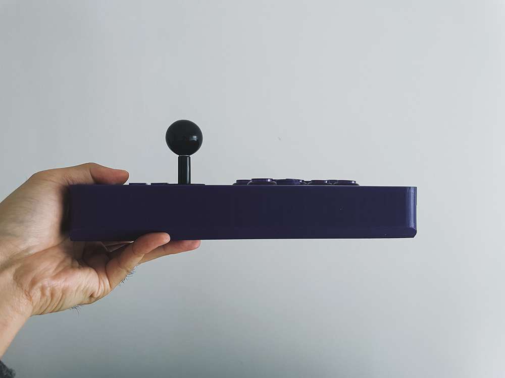

Hitboard Classic

Hitboard Classic – 不只是摇杆：可翻转、可滑动、可换轴、可配重、可塞主板的开源格斗外设平台。

Hitboard Classic —— 不只是摇杆

开场：科学街霸标准。
过去一段时间，我们一直在探索一个问题——好的格斗游戏外设，应该是什么样的。

由此提炼出一套科学街霸外设的标准：
* 分离式布局，放松肩膀。
* 左右对称 + 合理按键布局，减少手指疲劳。
* 功能键触手可及，提高训练场效率。
* 拨片加键键帽，跟拳脚键区分度高，不误触。
* 23-26mm 黄金尺寸，平衡触感与按键间距。
* 面板使用非金属、非玻璃材质，防止手感冰凉。

依据这些标准，我们做了 Hitboard Air。
但格斗外设，从来不该只有 Hitbox 这一种答案。

Hitboard vs 街机摇杆
Hitbox 把方向拆成四个独立开关——大脑先解构，手指再敲击。一步错，步步错。

街机摇杆不同。手掌、手腕、小臂协同发力——转圈、半圆，手腕一抖就出来。
长盘更稳，压力分散。这就是摇杆的哲学：不是更快，是更稳；不是拆解，是本能。

那既然摇杆这么科学，为什么被 Hitbox 抢尽风头，甚至举步维艰？
不是它不行了，是缺少创新的外设厂商，让摇杆跟不上时代。

通过本期视频——我们来让摇杆，再次伟大。

第一部分：传统摇杆的问题
布局问题：
33mm 按键间距，手指根本够不顺。
功能键又小又远，训练场里形同虚设。
左右手高低差——视觉上对齐了，用起来却一高一低。
结果：手掌频繁抬起、移动，多出废操作。手被架空。
需要给设备增加配重来减少晃动。

摇杆问题：
圆档丝滑但蹲防不准，方档准但搓招卡。
八角档两边不讨好。厂商图省事，丢给你一个“能用就行”。

按键问题：
街机按键手感特殊，键盘玩家上来就劝退。
想换自己喜欢的 MX 轴或矮轴？没门——轴座又贵又难改。

外观问题：
又大又重，2公斤起步，放桌上占半张桌，放腿上压得慌。
想自己动手改？纯亚克力堆叠，山寨感拉满。

这样，新人还没入门，就被劝退。

第二部分：Hitboard Classic 带来的新基准

基于此场景，我们推出 Hitboard Classic，用全新的基准来解决以上所有问题。

基准 1：科学布局
分离式布局
摇杆和按键拉开距离，肩膀自然放松。

对称布局
手掌对称，不是按键对称。
传统摇杆左右手高低差约35mm，Classic 把这个落差做到结构里，左右手掌始终在同一水平线。

优化的拳脚键布局
手掌自然放置就能覆盖所有按键。
现代模式也顺手。
自然放置的手掌，给设备提供了下压力，搓招不晃动。

功能键触手可及
功能键同 Air 一样放在左上角位置，左手无名指一勾就能按到，手不离杆。
三颗功能键，菜单、Func、重置，一个不落，提升训练场效率。

基准 2：黄金摇杆标准
衡量摇杆好不好用，看两个指令：半圆、前前。

传统摇杆的问题：
圆档滑，但斜角没档位，蹲防拉不到位。
玩家被迫换方圆档/八角档。蹲防稳了，但因为相比圆档压缩了活动空间，摇杆被吃掉了行程。

行程变短带来两个问题：搓招指令不清晰；弹簧弹力变小，回中变慢，影响前前指令。
为了补漏洞，就得换大弹力弹簧，整个手感反人类——就像骑最高齿比的自行车上坡，腿脚根本不受控。

Classic 的方案：圆方档位。
优先保证圆的丝滑，四角做小切角。
不刻意拉斜方向时，它就是圆；拉斜方向时，蹲防清晰。

使用圆方档位，能让前后指令吃满行程。
这样，玩家可以用轻克力弹簧，通过行程带来的张力来回中。
相比通过大力弹簧硬拉，更符合直觉。
行程大，更不容易串招。

人类的手掌非常敏锐，虽然只差了几个毫米的行程，几个克的弹力曲线。
但，理顺了，自然了，就好上手。
新手几乎零学习成本，练一练就能追上自己 Hitbox 的操作水平。

基准 3：快装轴座系统，实现按键自由
轴座自由
想用街机按键？可以。
想用 MX 轴？可以。
想用矮轴？也可以。

Classic 的快装轴座系统：买几个插簧，简单一装，就是机械轴轴座。
提供 MX 轴 / 矮轴 两种型号。
配合 24mm 盖板开孔，街机按键、矮轴、MX 轴，随便换。

根据每种轴体的行程，做了按键深度的适配，每种按键的按压都恰到好处。

键帽自由
提供 21mm 键帽（硬朗/圆润两种弧度），通过深度与边缘的配合，手感接近 23mm 键帽。
你也可以选择第三方的 21mm 键帽。
加键依然提供拨片形，薄、与拳脚键区分度高，不误触。
功能键支持全尺寸的键盘键帽。

基准 4：从极致的薄，到舒适的厚
（画面：厚度对比图 / 腿上使用示意图）

Air 做到了 9.3mm，全球最薄。因为它定位在桌面环境，越薄体验越好。

Classic 更多的考虑了舒适度、健康度问题？
如何能远离屏幕，如何能更放松。
答案是，放在腿上使用。

为了放腿上，就需要一定的厚度，给手臂支撑，减轻手腕压力，
为了广泛兼容玩家喜欢的各类摇杆，就需要 36mm 以上的内部空间。
为了实现壁纸自由，需要再留出 4mm 的亚克力盖板厚度，
那么，40mm 就是满足舒适性、可玩性、摇杆类产品的，最薄极限。

这个厚度，在视觉上恰好不会显得厚重。
配合长宽比、一定的切角设计，使它看起来很小巧，愿意把玩。

与市面上的摇杆相比：
传统摇杆：35×21×5.5 cm，4042 cm³，2kg。
Hitboard Classic：25.6×17.4×4 cm，1781 cm³，650g。
体积少 56%，重量轻 60%。

得益于基准 1，在全面减负的情况下。
你得到了对手臂友好的、不压腿的、布局开阔无晃动的，街机摇杆。

广阔的内部空间，也带来了更多的电路选项。
可以继续使用Pico + GP2040，获得易用的手柄/键盘系统。
也可以加入电池、无线芯片，来 DIY 无线方案。
甚至可以50 块买个二手手柄，拆主板、电池，放进去秒变无线摇杆。

总结：
Hitboard Classic 新基准
人体工学布局 —— 手掌对称，功能键触手可及
黄金摇杆标准 —— 圆方档位，丝滑且精准
快装轴座系统 —— 按键自由，免焊接零门槛
从极致的薄，到舒适的厚 —— 放腿无压，久玩不累

一套新基准，使摇杆变得科学、趁手、自由。
让摇杆，再次，伟大。

One more thing……一切皆可自定义

左右自定义
左撇子？右手方向、左手拳脚？
Classic 外壳左右对称，盖板上下对称。
翻转一下，镜像布局。
从形态到习惯，全部自定义。

形态自定义
不知道自己适合摇杆、Hitbox 还是 Mixbox？
Classic 全模块化设计。
拆掉摇杆，装上四个方向键 = Hitbox。
换上 WASD 盖板 = Mixbox。

配件自定义：
内部多个轨道，提供束线器、磁吸模块、电池仓、马达仓。按需 DIY。

Hitboard Classic 是什么？
不只是街机摇杆，而是一个格斗外设 DIY 平台。

如何开始？
Hitboard Creator for Classic，硬件自由，软件也自由。
一如既往简单强大。
一如既往，GitHub 搜索 Hitboard，打开网页工具，马上开始设计。

Hitboard
Find your fight.

